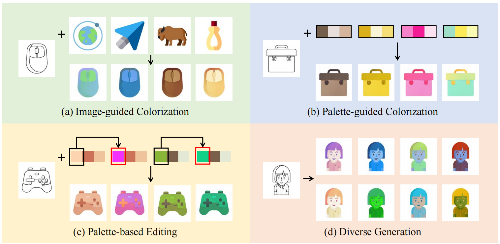

# FlexIcon

PyTorch Implementation of Our Paper "FlexIcon: Flexible Icon Colorization via Guided Images and Palettes".

<p align='center'>  
  
</p>

Note:

1 We apologize for not having time to clean up the repository. There may be some unnecessary parameters and code.

2 This version does not fully correspond to our paper since the original code is privately used for our project. However, you can use the current version as a baseline because the visual effects are approaching.


## Environment
```
python==3.8.16
numpy==1.21.1
torch==1.9.0
torchvision==0.10.0
tensorboard==2.5.0
scikit-image==0.18.2
opencv-python==4.7.0.72
```

## Datasets

**Icon** 

1 Follow the instruction in [IconFlow](https://github.com/djosix/IconFlow) to download and process the dataset.

2 Split the data into a training set and a test set. Please refer to folder "datasets" for the layout.

3 Use data/generate_palette_json.py to extract theme colors and produce a JSON file. You need to generate JSON files for the training color images and test color images separately.

**Mandala** 

Baidu Drive: [Downloading Link](https://pan.baidu.com/s/18IMkLcGjHYLGqpin747sxA). (Extraction Code: udtc).

## Training and Inference

**Image-guided Colorization**

Put a [Pretrained Vgg Model](https://pan.baidu.com/s/1z0KmArXn0AQMlEOlMtyjrQ) (Extraction Code: w794) in folder "models":

Training:
```
python train.py --dataroot ./datasets/icon/train --train_palette_json TRAIN_JSON_FILE --batchSize 6 --name Icon-128
```

Inference:
```
python test.py --dataroot ./datasets/icon/test --which_epoch latest --name Icon-128
```


**Palette-guided Colorization**

Use an Image-guided Colorization model:

Training: 
```
python train_palette.py --dataroot ./datasets/icon/train --train_palette_json TRAIN_JSON_FILE --fixed_model PRETRAINED_IMAGE_GUIDED_MODEL --model reference_model_palette --netG reference_generator_palette --batchSize 6 --name Icon-Palette-128
```

Inference:
```
python test_palette.py --dataroot ./datasets/icon/test --test_palette_json TEST_JSON_FILE --fixed_model PRETRAINED_IMAGE_GUIDED_MODEL --model reference_model_palette --netG reference_generator_palette --which_epoch latest --name Icon-Palette-128
```

* To achieve automatic or palette-based diverse colorization, you can add noises to a specific palette or directly use a random palette. For more details, please refer to Line 707-716 in file "data/aligned_dataset.py".

* To achieve style interpolation, you need to load the Image-guided model and Palete-guided model, and then adjust the weights applied to the encoded style features. For more details, please refer to Line 164 in file "models/reference_generator_palette.py".


## Citation

If you find this useful for your research, please cite our paper.


    @inproceedings{wu2023flexicon,
         title={FlexIcon: Flexible Icon Colorization via Guided Images and Palettes},
         author={Wu, Shukai and Yang, Yuhang and Xu, Shuchang and Liu, Weiming and Yan, Xiao and Zhang, Sanyuan},
         booktitle={Proceedings of the 31st ACM International Conference on Multimedia},
         pages={8662--8673},
         year={2023}
    }


## Acknowledgments

This version borrows some code from [DeepSIM](https://github.com/eliahuhorwitz/DeepSIM), [CoCosNet](https://github.com/microsoft/CoCosNet) and [IconFlow](https://github.com/djosix/IconFlow).


